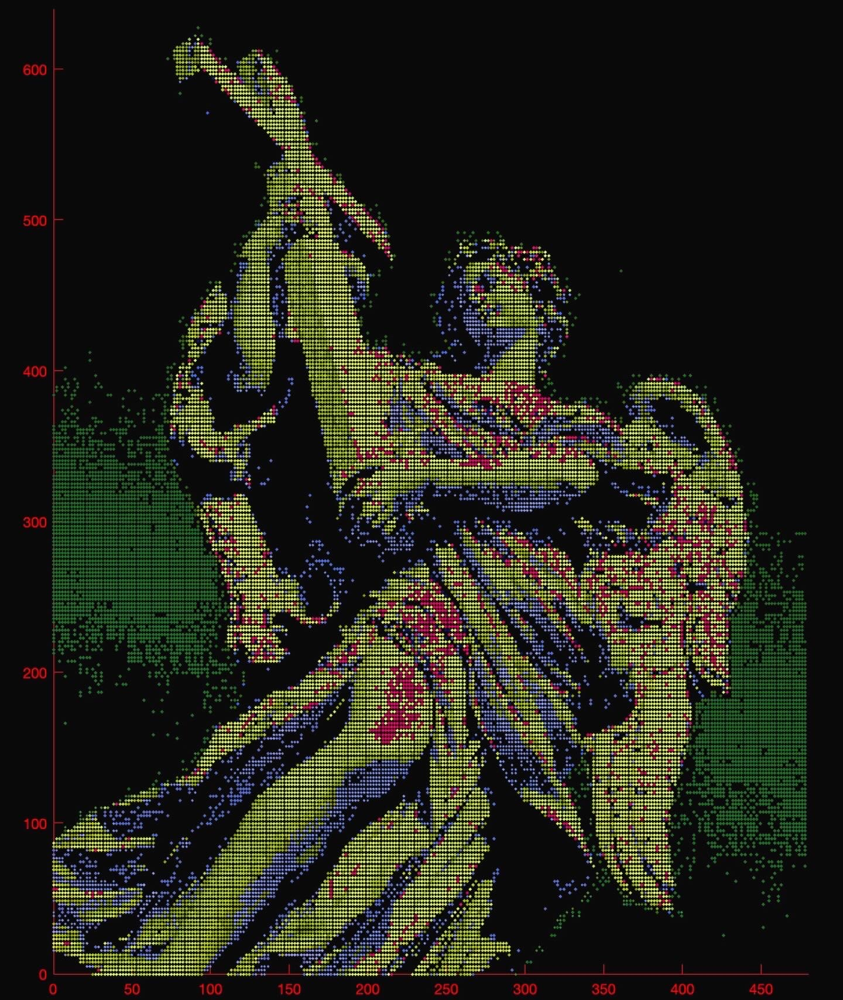
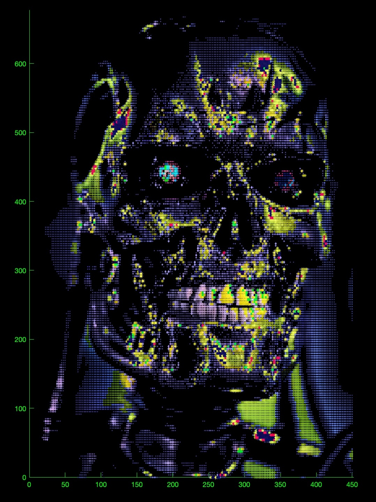
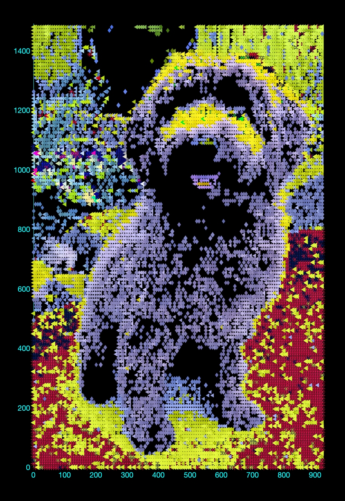

# MATpixelator
MATpixelator is a MATLAB script that transforms an input image into a pixelated version with customizable options for personalization.

## Getting Started
All instructions and guidelines are clearly documented within the code as comments. Follow the instructions line by line, adjusting the parameters to suit your preferences. Example inputs are provided in the code as reference starting points.

## Sample Images

|  |  |  |
|-------------------------|-------------------------|-------------------------|

